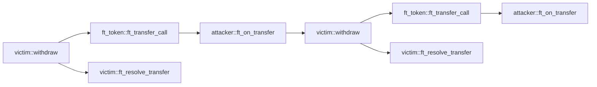

## Reentrancy

### Configuration

* detector id: `reentrancy`
* severity: high

### Description

Find functions that are vulnerable to reentrancy attack.

Contracts should always change state before making a cross-contract invocation and roll back the changes in the callback function if the cross-contract invocation fails.

### Sample code

Here is an example of a reentrancy attack. The victim contract updates the state (i.e., `attacker_balance`) in the function `ft_resolve_transfer` only after transferring to the attacker successfully.

The victim contract invokes `ft_token::ft_transfer_call` to transfer tokens, which will invoke the attacker's `ft_on_transfer` after internal transferring.

However, if the attacker's `ft_on_transfer` invokes the victim's `withdraw` again, the victim will transfer again to the attacker since the state (i.e., `attacker_balance`) hasn't been changed yet.

The call graph is:



Attacker contract:

```rust
#[near_bindgen]
impl MaliciousContract {
    pub fn ft_on_transfer(&mut self, amount: u128) {
        if self.reentered == false {
            ext_victim::withdraw(
                amount.into(),
                &VICTIM,
                0,
                env::prepaid_gas() - GAS_FOR_SINGLE_CALL,
            );
        }
        self.reentered = true;
    }
}

```

FT contract:

```rust
#[near_bindgen]
impl FungibleToken {
    pub fn ft_transfer_call(&mut self, amount: u128) -> PromiseOrValue<U128> {
        // internal transfer
        self.attacker_balance += amount;
        self.victim_balance -= amount;

        ext_fungible_token_receiver::ft_on_transfer(
            amount.into(),
            &ATTACKER,
            0,
            env::prepaid_gas() - GAS_FOR_SINGLE_CALL,
        )
        .into()
    }
}
```

Victim contract:

```rust
#[near_bindgen]
impl VictimContract {
    pub fn withdraw(&mut self, amount: u128) -> Promise {
        assert!(self.attacker_balance >= amount);
        ext_ft_token::ft_transfer_call(
            amount.into(),
            &FT_TOKEN,
            0,
            env::prepaid_gas() - GAS_FOR_SINGLE_CALL * 2,
        ).then(ext_self::ft_resolve_transfer(
            amount.into(),
            &env::current_account_id(),
            0,
            GAS_FOR_SINGLE_CALL,
        ))
    }

    #[private]
    pub fn ft_resolve_transfer(&mut self, amount: u128) {
        match env::promise_result(0) {
            PromiseResult::NotReady => unreachable!(),
            PromiseResult::Successful(_) => {
                self.attacker_balance -= amount;
            }
            PromiseResult::Failed => {}
        };
    }
}
```

The correct implementation is to change the state before calling an external function and recover the state only when the promise fails.

```rust
#[near_bindgen]
impl VictimContract {
    pub fn withdraw(&mut self, amount: u128) -> Promise {
        assert!(self.attacker_balance >= amount);
        self.attacker_balance -= amount;
        ext_ft_token::ft_transfer_call(
            amount.into(),
            &FT_TOKEN,
            0,
            env::prepaid_gas() - GAS_FOR_SINGLE_CALL * 2,
        ).then(ext_self::ft_resolve_transfer(
            amount.into(),
            &env::current_account_id(),
            0,
            GAS_FOR_SINGLE_CALL,
        ))
    }

    #[private]
    pub fn ft_resolve_transfer(&mut self, amount: u128) {
        match env::promise_result(0) {
            PromiseResult::NotReady => unreachable!(),
            PromiseResult::Successful(_) => {}
            PromiseResult::Failed => {
                self.attacker_balance += amount;
            }
        };
    }
}
```
